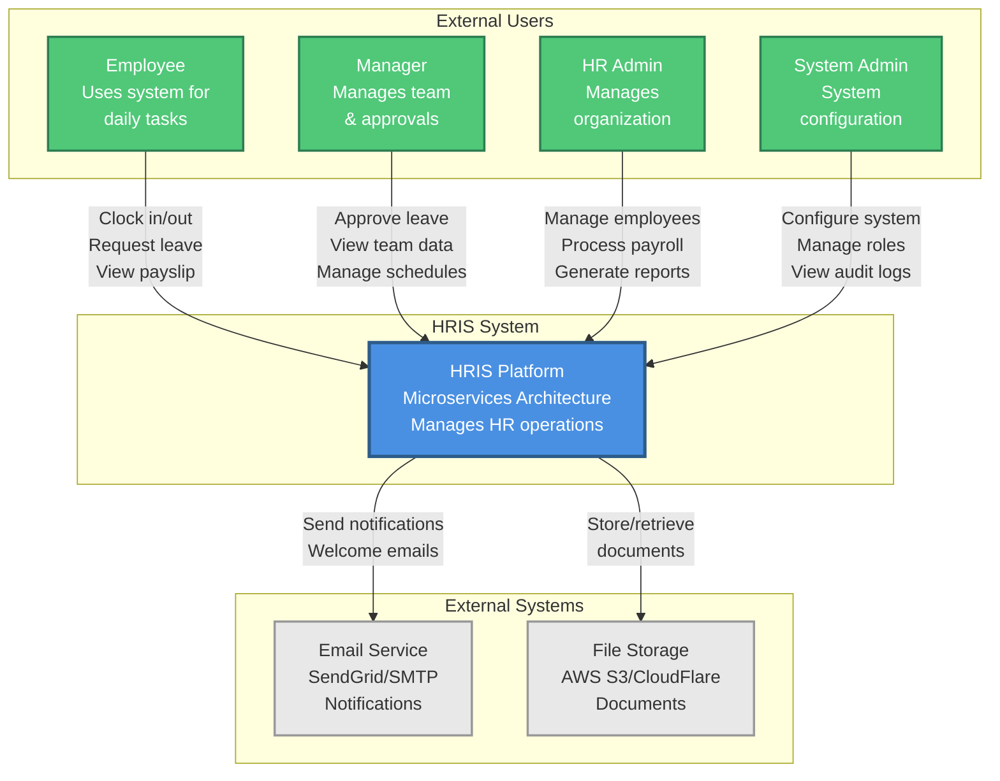

# HRIS Microservices - System Context Diagram (C4 Level 1)

## Overview

This diagram shows the high-level system context of the HRIS (Human Resource Information System) and how it interacts with users and external systems.

## System Context Diagram

## Actors

### Employees

- **Primary Users**: All company employees
- **Use Cases**:
  - Clock in/out for attendance
  - Submit leave requests
  - View personal data and payslips
  - Update profile information
  - View work schedules

### Managers

- **Role**: Team leaders, department heads
- **Use Cases**:
  - Approve/reject leave requests
  - View team attendance reports
  - Manage team schedules
  - Access department payroll summaries

### HR Administrators

- **Role**: Human Resources staff
- **Use Cases**:
  - Onboard/offboard employees
  - Process monthly payroll
  - Configure leave policies
  - Generate organization-wide reports
  - Manage employee benefits

### System Administrators

- **Role**: IT administrators
- **Use Cases**:
  - Manage user roles and permissions
  - Configure system settings
  - View system audit logs
  - Monitor system health
  - Manage integrations

## External Systems

### Email Service

- **Purpose**: Transactional email delivery
- **Examples**: SendGrid, AWS SES, or SMTP
- **Usage**:
  - Welcome emails for new employees
  - Leave approval notifications
  - Payslip delivery
  - Password reset emails
  - System alerts

### File Storage

- **Purpose**: Document and file management
- **Examples**: AWS S3, Cloudflare R2
- **Usage**:
  - Employee profile pictures
  - Document attachments (contracts, certificates)
  - Payslip PDFs
  - Company policy documents

## Key Capabilities

The HRIS system provides:

1. **Employee Management**: Complete employee lifecycle management
2. **Attendance Tracking**: Time and attendance monitoring
3. **Leave Management**: Leave request and approval workflows
4. **Payroll Processing**: Automated salary calculations and payslip generation
5. **Notifications**: Real-time updates and email notifications
6. **Reporting**: Comprehensive HR analytics and reports
7. **Access Control**: Role-based permissions and security

## Technology Overview

- **Architecture**: Microservices
- **Communication**: REST APIs + Message Queue (RabbitMQ)
- **Database**: PostgreSQL (one per service)
- **Cache**: Redis
- **Frontend**: Next.js (React)
- **Deployment**: Containerized (Docker)

## Security Considerations

- JWT-based authentication
- Role-based access control (RBAC)
- Encrypted data transmission (HTTPS)
- Audit logging for compliance
- Password hashing (bcrypt)
- Token refresh mechanism
- Rate limiting

---

**Next**: [Container Diagram](./02-container-diagram.md) - Internal system structure
