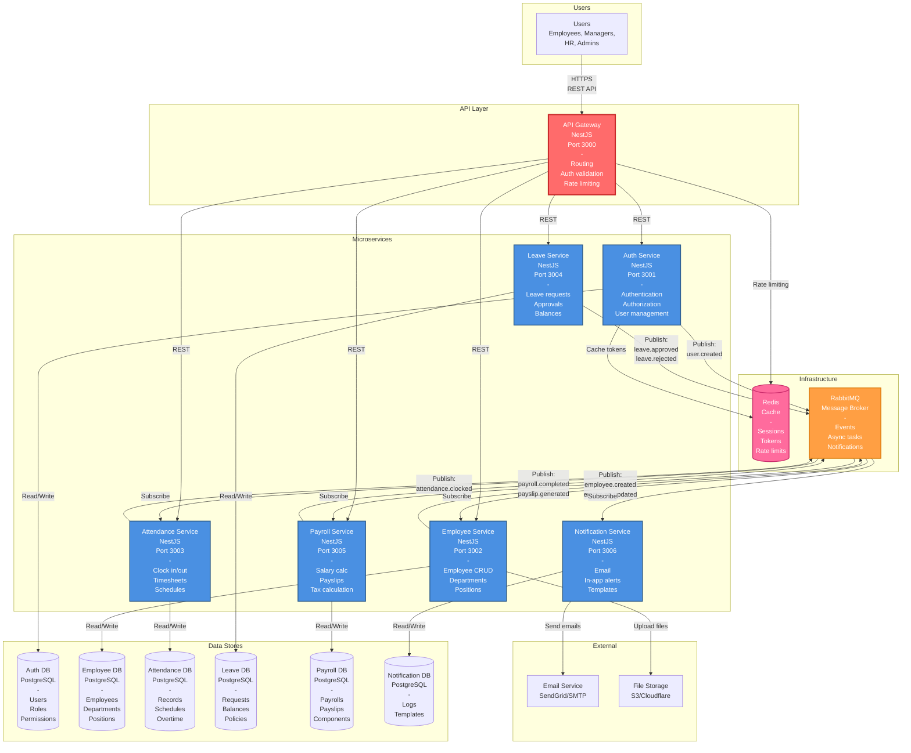

# HRIS Microservices - Container Diagram (C4 Level 2)

## Overview

This diagram shows the internal structure of the HRIS system, breaking it down into containers (applications and data stores).

## Container Diagram



## Containers Description

### API Gateway (Port 3000)

**Technology**: NestJS + Express
**Responsibilities**:

- Single entry point for all client requests
- Route requests to appropriate microservices
- JWT token validation
- Rate limiting
- Request/response logging
- Load balancing (future)

**Key Routes**:

- `/api/auth/*` → Auth Service
- `/api/employees/*` → Employee Service
- `/api/attendance/*` → Attendance Service
- `/api/leave/*` → Leave Service
- `/api/payroll/*` → Payroll Service

---

### Auth Service (Port 3001)

**Technology**: NestJS + Prisma + PostgreSQL
**Database**: auth_db

**Responsibilities**:

- User authentication (login/logout)
- JWT token generation & refresh
- Password management
- Role-based access control (RBAC)
- Permission validation
- Session management

**Key Endpoints**:

- `POST /auth/login`
- `POST /auth/logout`
- `POST /auth/refresh`
- `POST /auth/forgot-password`
- `GET /auth/me`
- `GET /auth/permissions`

**Events Published**:

- `user.created`
- `user.updated`
- `user.password_changed`

---

### Employee Service (Port 3002)

**Technology**: NestJS + Prisma + PostgreSQL
**Database**: employee_db

**Responsibilities**:

- Employee master data management
- Department hierarchy
- Position/job title management
- Employee documents
- Organization structure

**Key Endpoints**:

- `POST /employees`
- `GET /employees/:id`
- `PATCH /employees/:id`
- `DELETE /employees/:id`
- `GET /departments`
- `GET /positions`

**Events Published**:

- `employee.created`
- `employee.updated`
- `employee.deleted`
- `employee.onboarded`

**Events Subscribed**:

- `user.created` → Create employee profile

---

### Attendance Service (Port 3003)

**Technology**: NestJS + Prisma + PostgreSQL
**Database**: attendance_db

**Responsibilities**:

- Clock in/out tracking
- Timesheet generation
- Work schedule management
- Overtime calculation
- Attendance reports

**Key Endpoints**:

- `POST /attendance/clock-in`
- `POST /attendance/clock-out`
- `GET /attendance/timesheet`
- `GET /attendance/reports`
- `POST /attendance/overtime`

**Events Published**:

- `attendance.clocked_in`
- `attendance.clocked_out`
- `overtime.requested`
- `overtime.approved`

**Events Subscribed**:

- `employee.created` → Initialize attendance record
- `leave.approved` → Update attendance calendar

---

### Leave Service (Port 3004)

**Technology**: NestJS + Prisma + PostgreSQL
**Database**: leave_db

**Responsibilities**:

- Leave request workflow
- Approval chain management
- Leave balance tracking
- Leave policy configuration
- Leave calendar

**Key Endpoints**:

- `POST /leave/requests`
- `GET /leave/requests/:id`
- `PATCH /leave/requests/:id/approve`
- `PATCH /leave/requests/:id/reject`
- `GET /leave/balance`
- `GET /leave/policies`

**Events Published**:

- `leave.requested`
- `leave.approved`
- `leave.rejected`
- `leave.cancelled`

**Events Subscribed**:

- `employee.created` → Initialize leave balance

---

### Payroll Service (Port 3005)

**Technology**: NestJS + Prisma + PostgreSQL
**Database**: payroll_db

**Responsibilities**:

- Monthly payroll calculation
- Payslip generation
- Salary component management
- Tax & deduction calculation
- Payroll reports

**Key Endpoints**:

- `POST /payroll/process`
- `GET /payroll/payslips/:id`
- `GET /payroll/payslips/employee/:employeeId`
- `GET /payroll/components`
- `POST /payroll/deductions`

**Events Published**:

- `payroll.initiated`
- `payroll.calculated`
- `payroll.completed`
- `payslip.generated`

**Events Subscribed**:

- `employee.created` → Set up salary components
- `attendance.overtime_approved` → Add to payroll
- `leave.approved` → Calculate leave deductions

---

### Notification Service (Port 3006)

**Technology**: NestJS + Prisma + PostgreSQL
**Database**: notification_db

**Responsibilities**:

- Email notifications
- In-app notifications
- Notification templates
- Delivery tracking
- SMS (mocked for demo)

**Key Endpoints**:

- `GET /notifications`
- `PATCH /notifications/:id/read`
- `GET /notifications/templates`

**Events Subscribed**:

- `user.created` → Send welcome email
- `leave.approved` → Notify employee
- `leave.rejected` → Notify employee
- `payslip.generated` → Send payslip email
- `employee.onboarded` → Send onboarding email

---

## Infrastructure Components

### PostgreSQL Databases

- **Strategy**: Database per service (microservices best practice)
- **Connection**: Each service has its own database
- **Isolation**: Complete data ownership per service
- **Schema**: Managed via Prisma migrations

### Redis

**Purpose**: Caching and session storage
**Use Cases**:

- JWT token blacklisting
- User session storage
- Rate limiting counters
- Cache frequently accessed data

### RabbitMQ

**Purpose**: Asynchronous communication
**Pattern**: Publish-Subscribe (Event-Driven)
**Exchanges**:

- `hris.events` - Main event exchange
- `hris.dlx` - Dead letter exchange

**Key Queues**:

- `notifications.email`
- `notifications.inapp`
- `employee.events`
- `leave.events`
- `payroll.events`

---

## Communication Patterns

### Synchronous (REST)

**Used for**:

- Real-time queries
- Immediate validation
- CRUD operations
- Client-facing APIs

**Example Flow**:

```
Client → Gateway → Service → Database → Response
```

### Asynchronous (Events)

**Used for**:

- Background processing
- Decoupled operations
- Notifications
- Data synchronization

**Example Flow**:

```
Service A → Publish Event → RabbitMQ → Service B subscribes → Process
```

---

## Scalability Considerations

### Horizontal Scaling

- Each service can scale independently
- Load balancer in front of gateway (future)
- Database read replicas (future)

### Caching Strategy

- Redis for frequently accessed data
- Service-level caching with TTL
- Cache invalidation on updates

### Message Queue

- Handles traffic spikes
- Retry mechanism for failures
- Dead letter queue for failed messages

---

## Security Layers

1. **API Gateway**: JWT validation, rate limiting
2. **Service Level**: Permission checking, data validation
3. **Database**: Row-level security (future consideration)
4. **Network**: Service mesh (future consideration)

---

**Next**: [Component Diagram](./03-component-diagram.md) - Internal service structure
**Previous**: [System Context](./01-system-context.md)
