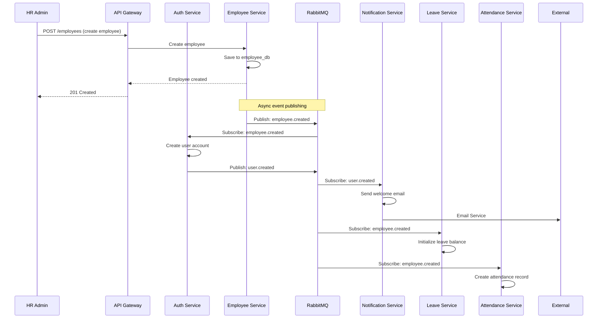
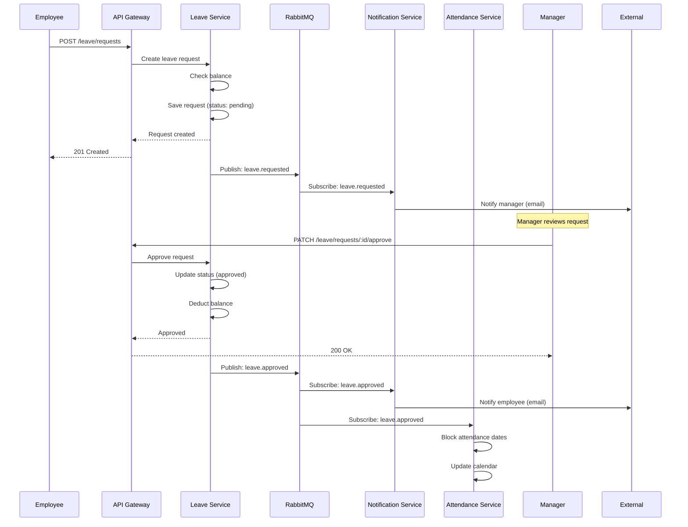
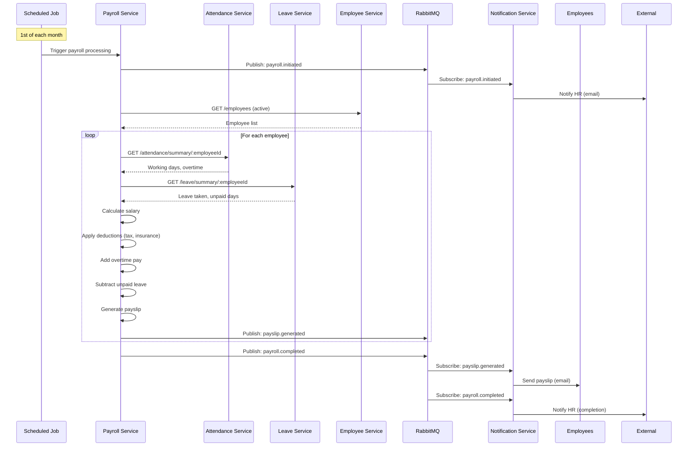
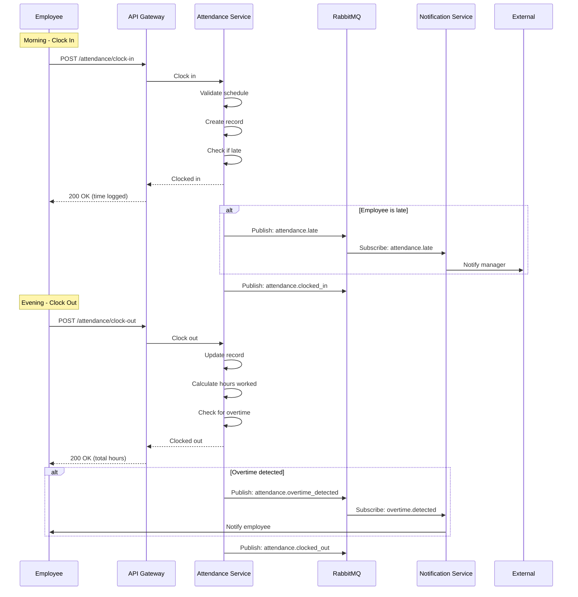
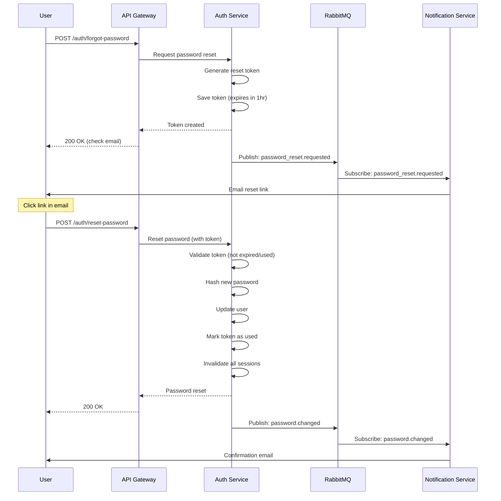

# HRIS Microservices - Event Flow Diagrams

## Overview

This document illustrates key event-driven workflows in the HRIS system, showing how services communicate asynchronously via RabbitMQ.

---

## 1. Employee Onboarding Flow



**Event Flow**:

1. HR creates employee via API
2. Employee Service publishes `employee.created` event
3. Auth Service creates user account → publishes `user.created`
4. Notification Service sends welcome email
5. Leave Service initializes leave balances
6. Attendance Service creates attendance record

**Result**: New employee fully onboarded across all systems

---

## 2. Leave Request & Approval Flow



**Event Flow**:

1. Employee submits leave request
2. Leave Service publishes `leave.requested` → Manager notified
3. Manager approves request
4. Leave Service publishes `leave.approved`
5. Notification Service notifies employee
6. Attendance Service blocks dates in calendar

**Business Rules**:

- Balance checked before approval
- Automatic calendar blocking
- Multi-channel notifications

---

## 3. Monthly Payroll Processing Flow



**Event Flow**:

1. Scheduled job triggers payroll (1st of month)
2. Payroll Service publishes `payroll.initiated`
3. Service queries attendance and leave data
4. For each employee:
   - Calculate net salary
   - Generate payslip
   - Publish `payslip.generated` event
5. Notification Service sends payslips via email
6. Publish `payroll.completed` → HR notified

**Calculations Include**:

- Base salary
- Overtime pay
- Deductions (tax, insurance)
- Unpaid leave deductions
- Bonuses/allowances

---

## 4. Attendance Clock In/Out Flow



**Event Flow**:

1. Employee clocks in → record created
2. If late → manager notified
3. Employee clocks out → hours calculated
4. If overtime → employee notified
5. Events published for audit trail

**Business Rules**:

- Validation against work schedule
- Late detection (15 min threshold)
- Overtime calculation (>8 hours/day)
- Real-time notifications

---

## 5. Password Reset Flow



**Event Flow**:

1. User requests password reset
2. Auth Service generates token → publishes event
3. Notification Service sends reset email
4. User submits new password
5. Auth Service validates and updates
6. Confirmation email sent

**Security**:

- Token expires in 1 hour
- Single-use tokens
- All sessions invalidated
- Email confirmation

---

## Event Catalog

### Employee Domain Events

| Event                | Publisher        | Subscribers                           | Payload                               |
| -------------------- | ---------------- | ------------------------------------- | ------------------------------------- |
| `employee.created`   | Employee Service | Auth, Leave, Attendance, Notification | employeeId, name, email, departmentId |
| `employee.updated`   | Employee Service | Notification                          | employeeId, changes                   |
| `employee.deleted`   | Employee Service | Auth, Leave, Attendance               | employeeId                            |
| `employee.onboarded` | Employee Service | Notification                          | employeeId, name, email               |

### Leave Domain Events

| Event             | Publisher     | Subscribers              | Payload                                 |
| ----------------- | ------------- | ------------------------ | --------------------------------------- |
| `leave.requested` | Leave Service | Notification             | requestId, employeeId, managerId, dates |
| `leave.approved`  | Leave Service | Attendance, Notification | requestId, employeeId, dates            |
| `leave.rejected`  | Leave Service | Notification             | requestId, employeeId, reason           |
| `leave.cancelled` | Leave Service | Attendance, Notification | requestId, employeeId                   |

### Attendance Domain Events

| Event                          | Publisher          | Subscribers           | Payload                               |
| ------------------------------ | ------------------ | --------------------- | ------------------------------------- |
| `attendance.clocked_in`        | Attendance Service | - (audit only)        | employeeId, timestamp, location       |
| `attendance.clocked_out`       | Attendance Service | - (audit only)        | employeeId, timestamp, hoursWorked    |
| `attendance.late`              | Attendance Service | Notification          | employeeId, scheduledTime, actualTime |
| `attendance.overtime_detected` | Attendance Service | Notification, Payroll | employeeId, date, overtimeHours       |

### Payroll Domain Events

| Event                | Publisher       | Subscribers    | Payload                              |
| -------------------- | --------------- | -------------- | ------------------------------------ |
| `payroll.initiated`  | Payroll Service | Notification   | month, year                          |
| `payroll.calculated` | Payroll Service | - (audit only) | month, year, employeeCount           |
| `payroll.completed`  | Payroll Service | Notification   | month, year, totalAmount             |
| `payslip.generated`  | Payroll Service | Notification   | payslipId, employeeId, month, netPay |

### Auth Domain Events

| Event                      | Publisher    | Subscribers            | Payload                     |
| -------------------------- | ------------ | ---------------------- | --------------------------- |
| `user.created`             | Auth Service | Employee, Notification | userId, email, roles        |
| `user.updated`             | Auth Service | Notification           | userId, changes             |
| `password.changed`         | Auth Service | Notification           | userId                      |
| `password_reset.requested` | Auth Service | Notification           | userId, resetToken (hashed) |

---

## Event-Driven Benefits

✅ **Loose Coupling**: Services don't need to know about each other
✅ **Scalability**: Can process events asynchronously
✅ **Resilience**: Failed events can be retried
✅ **Audit Trail**: All events logged for compliance
✅ **Flexibility**: Easy to add new subscribers without changing publishers
✅ **Real-time**: Instant notifications and updates

---

## Message Reliability

### Delivery Guarantees

- **At-least-once delivery**: Messages may be redelivered
- **Idempotent handlers**: Services handle duplicate events safely
- **Dead Letter Queue**: Failed messages moved to DLQ for investigation

### Retry Strategy

```typescript
{
  attempts: 3,
  backoff: {
    type: 'exponential',
    delay: 1000, // 1s, 2s, 4s
  }
}
```

---

**Next**: [Database Schemas](../database/schemas.md)
**Previous**: [Container Diagram](./02-container-diagram.md)
